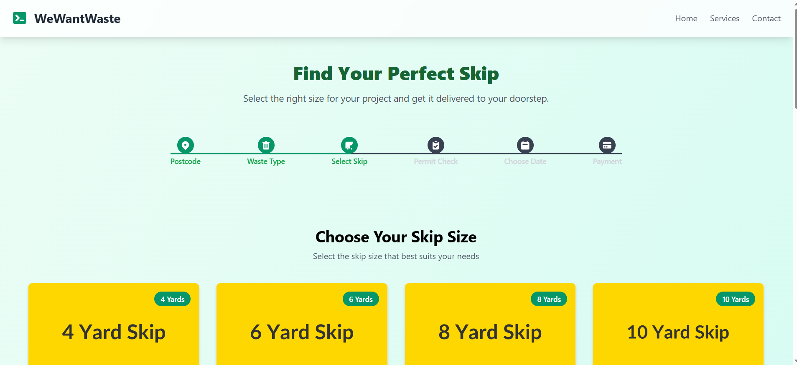
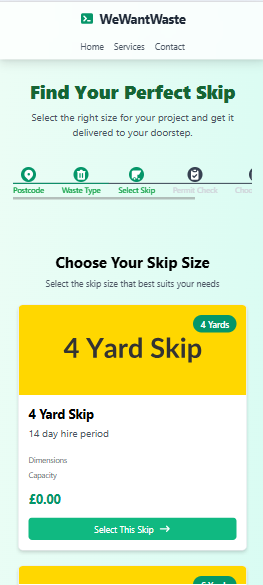

# WeWantWaste Skip Selector


A responsive React application for selecting and ordering skips based on size, price, and specifications. This application is part of the WeWantWaste waste management service platform.

## Features

- **Intuitive Skip Selection**: Browse and select from various skip sizes with detailed specifications
- **Visual Progress Tracking**: Clear step indicator showing the ordering process from postcode entry to payment
- **Responsive Design**: Fully responsive layout that works seamlessly on mobile, tablet, and desktop devices
- **Accessibility Focused**: ARIA attributes, semantic HTML, and keyboard navigation support
- **Real-time API Integration**: Fetches skip data from the WeWantWaste API

## Screenshots

### Desktop View


### Mobile View


## Technologies Used

- **React**: Frontend UI library
- **Vite**: Build tool and development server
- **Tailwind CSS**: Utility-first CSS framework for styling
- **React Testing Library**: Component testing
- **Jest**: Test runner
- **Mock Service Worker (MSW)**: API mocking for tests

## Getting Started

### Prerequisites

- Node.js (v16 or higher)
- npm or yarn

### Installation

1. Clone the repository
   ```bash
   git clone https://github.com/sinemsevimlikurt/wewantwaste-skip-selector.git
   cd wewantwaste-skip-selector
   ```

2. Install dependencies
   ```bash
   npm install
   # or
   yarn
   ```

3. Start the development server
   ```bash
   npm run dev
   # or
   yarn dev
   ```

4. Open your browser and navigate to `http://localhost:5173`

## Project Structure

```
src/
├── components/
│   ├── ProgressSteps.jsx       # Step indicator component
│   ├── ProgressSteps.test.jsx  # Tests for ProgressSteps
│   ├── SkipSizeSelection.jsx   # Skip selection and display component
│   └── SkipSizeSelection.test.jsx # Tests for SkipSizeSelection
├── App.jsx                     # Main application component
├── App.css                     # Global styles
├── main.jsx                    # Application entry point
└── index.css                   # Tailwind CSS imports
```

## Component Overview

### ProgressSteps

Displays the user's progress through the skip ordering process with six steps:
1. Postcode
2. Waste Type
3. Select Skip
4. Permit Check
5. Choose Date
6. Payment

Features include:
- Visual indication of completed steps
- Clickable completed steps for navigation
- Connector lines between steps
- Accessible keyboard navigation

### SkipSizeSelection

Fetches and displays available skip options based on location:
- Shows skip size, hire period, dimensions, capacity, and price
- Handles loading states with spinner
- Provides error handling with retry option
- Responsive grid layout for different screen sizes

## API Integration

The application connects to the WeWantWaste API to fetch skip data:

```
API Endpoint: https://app.wewantwaste.co.uk/api/skips/by-location
Default Parameters: postcode=NR32&area=Lowestoft
```

## Testing

Run the test suite with:

```bash
npm test
# or
yarn test
```

Tests cover:
- Component rendering
- User interactions
- API data fetching
- Error handling
- Accessibility features

## Deployment

Build the application for production:

```bash
npm run build
# or
yarn build
```

The build output will be in the `dist` directory, ready to be deployed to any static hosting service.

## Accessibility

This application is built with accessibility in mind:
- Semantic HTML structure
- ARIA roles and attributes
- Keyboard navigation support
- Screen reader friendly content
- Focus management for interactive elements

## License

© 2025 WeWantWaste. All rights reserved.

## Contact

If you have any questions or would like to connect, feel free to reach out:

- **Name:** Sinem Sevimlikurt
- **Email:** sevimlikurtsinem@gmail.com
- **LinkedIn:** [linkedin.com/in/sinem-sevimlikurt](https://linkedin.com/in/sinem-sevimlikurt)
- **GitHub:** [github.com/sinemsevimlikurt](https://github.com/sinemsevimlikurt)

